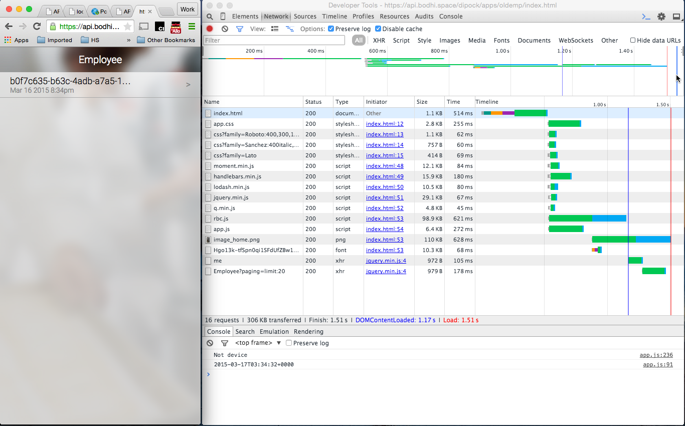
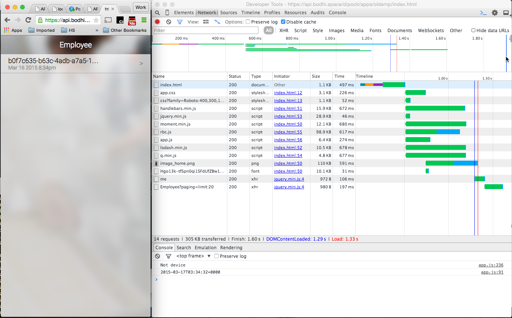
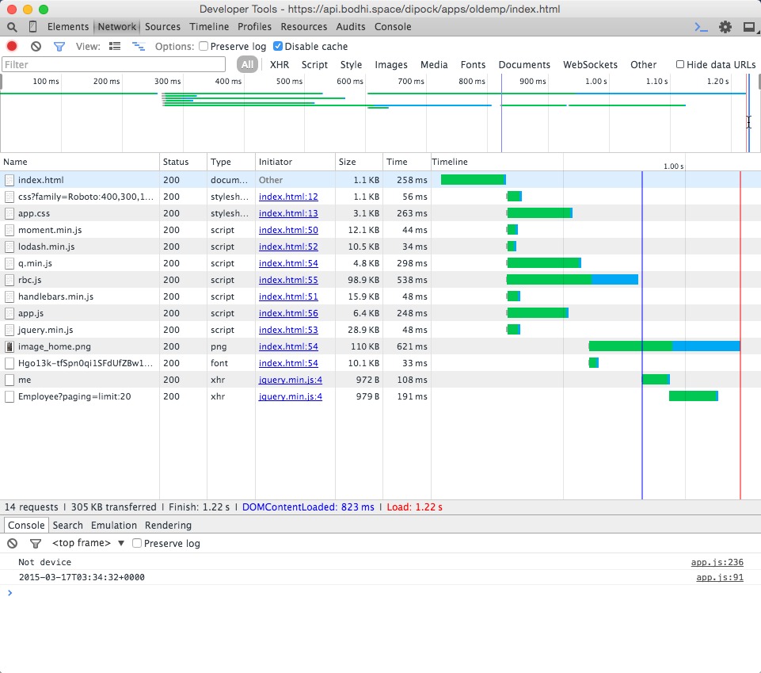

#Performance tuning the app 

### Overview

The Bodhi mobile application is a web application that runs in a native container on the user's mobile device. 

This means that, like any web application, it is bound by the same rules and potential inefficiencies of any web application - but exacerbated because the application is now running on a user's mobile device with reduced processing power and limited bandwidth when compared to a regular web application running on a desktop. 

When building and testing your application on a WIFI or 4G network it is easy to forget that 3G is the dominant network type globally, so you should assume your app is on a 3G network and that each network request will take, on average, 200 milliseconds.

Additional time needs to be added for the DNS lookup to resolve the hostname (e.g. api.bodhi.space) to an IP address, a subsequent network roundtrip to perform the TCP handshake and a full network roundtrip to send the HTTP request. Finally, add an additional 600ms for the typical sequence of communication between your app and a server, for network overhead. With so much overhead you need to be conscious of simple mistakes that can impact the performance of the application - especially if you are taking an existing web application and moving it to a mobile device.   

You have already made the first major improvement for performance - that is, using the Bodhi cloud as your back end service and working on the data model to collect, pre-process, massage and filter the data so that it is ready to be pulled, served or pushed to your mobile application. 

You have built your mobile app and happy with the functionality. So now you are ready to focus on performance testing and tuning of the app.

There are many good articles and books that will help you improve the performance of your web app. We recommend starting with the following:

*  **High Performance Web Sites**  [here](hhttp://stevesouders.com/hpws/).

*  **Measuring page load speed with Navigation Timing**  [here](http://www.html5rocks.com/en/tutorials/webperformance/basics/). 

*  **Mobile Analysis in PageSpeed Insights** [here](https://developers.google.com/speed/docs/insights/mobile).

This article is not intended to cover all aspects of performance optimization but the following exercise will demonstrate the quick wins that you can accomplish by following the best practices discussed in the articles mentioned above. 

### Example exercise

The following application is a web application that we will optimize for mobile devices.

When we run the application we can see that the application takes 1.51 seconds to load. 

Looking at the source code we can see that there are several webfonts being loaded - each is a separate request adding 60-70 ms to the load time of the application. On review we see that none of the additional fonts are used in our CSS. So we can remove those.

Note: if you do need to load several fonts, you can do this in one request instead of making multiple individual requests as follows:

	<link href='http://fonts.googleapis.com/css?family=Lato:100,400|Roboto:400,100' rel='stylesheet' type='text/css'>

Running the application we've saved about 120ms by not loading fonts we don't need.

The next step makes sure we load the web font before it is required in the CSS file.

 

 

